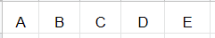

 # Reading: Sets

 ## Table of Contents

### Sets
* [Introduction/Define](#h1)
* [Purpose of sets](#h2)
* [Applications/Example](#h4)
* [Problem to Solve](#h6)
* [Key Terms](#h7)

### <a name="h1"></a>**Introduction/Define**
A **set** acts much like a list with a few key differences, it does not add duplicate data and it is not organized. In a lists we can have multiple copies of data such as [1, 2, 1, 4, 5, 2, 3]. However, when we add to a set the data there will be only one copy to remain in the set. For example if we tried to add [1, 2, 1, 4, 5, 2, 3] we would get [1, 2, 4, 5, 3] but perhaps in a different order.
For example we might input ['A', B', 'C', 'D', 'E']



However the order might change due to the function of sets. Like so:


### <a name="h2"></a>**Purpose of sets**
Now why would we want to have sets? The data gets jumbled around and if it's jumbled around what good does it serve? Well because it doesn't allow duplicates we can search for a unique input. For example, when creating a username for an email account or other online service have you ever come accross the error along the lines of "Username is already taken"? Sets can be used to notify the user if the input is already in a large set of data. This technique is called **hashing** which enables the programmer to add, remove, and test to see if data is already in a set in O(1) time.

### <a name="h4"></a>**Applications/Example**
In many instances we can achieve an O(1) time. If we wanted to add a set including "a, b, c" we can use the `add()` function like so:

```python
# This will create our set
set1 = set()

# Add our values
set1.add('a')
set1.add('b')
set1.add('c')

# Print out our set and we'll get ['a', 'b'. 'c']
print(set1)
```

### <a name="h6"></a>**Problem to Solve**
Here is a problem for you to solve and try out! [Sets Problem](Sets_Solve-2.1.py)

Please compare your answer once you have finished attempting the problem above. [Sets Solution](Sets_Solve_Answer-2.1.py)
### <a name="h7"></a>**Key Terms**

|Common Set Operation|    Description   |      Python Code     |    Performance    |
|:--------------------:|:----------------:|:--------------------:|:-----------------:|
|add(value)          |Adds "value" to the set|my_set.add(value)|O(1) - Performance of hashing the value (assuming good conflict resolution)|
|remove(value)       |Removes the "value" from the set|my_set.remove(value)|O(1) - Performance of hashing the value (assuming good conflict resolution)|
|member(value)       |Determines if "value" is in the set|if value in my_set:|O(1) - Performance of hashing the value (assuming good conflict resolution)|
|size()              |Returns the number of items in the set|length = len(my_set)|O(1) - Performance of returning the size of the set|

* **hashing** - The process of mapping an item to an index location using a hashing function. Since the function does not require searching throught the data structure, hashing can result in an O(1) in the best case.

* **hashing function** - A function that converts the value of an item to a numerical index value. The hashing function will include a modulo operation to ensure the resulting index is within range of the sparsed list.

* **set** - A data structure that maps data to an index based on a hashing function. Sets can only hold unique data because of the hashing function. Sets are useful for summarizing data and finding duplicates.

* **sparse list** - An array that is only partially filled. To avoid conflicts in a set, a sparse list must have sufficient empty space to allow for new additions. If a sparse list gets too full, a large sparsed list could be created with an updated hashing function.

Click [here](https://github.com/wjacobb/DS-FinalProject/blob/main/DS-FinalProject/Welcome.md) to return to the Welcome page.
