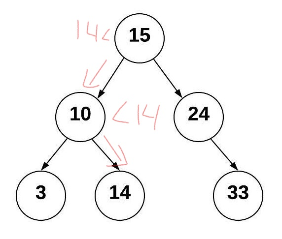

# Reading: Trees

## Table of Contents

### Trees
* [Introduction/Define](#h1)
* [Purpose of Trees](#h2)
* [Inserting into Trees](#h3)
* [Navigating Trees](#h4)
* [Balanced Search Trees](#h5)
* [Example](#h6)
* [Problem to Solve](#h7)
* [Key Terms](#h8)

### <a name="h1"></a>**Introduction/Define**

**Trees** in data structures are much like linked lists in teh way that the nodes are connected together through pointers. The key difference is that a tree can connect to multiple different nodes. A few things that we'll be talking about is the purpose of trees, inserting to trees, balancing trees, and navigating them.

### <a name="h2"></a>**Purpose of Trees**
The purpose of trees is to navigate through data at a quick and efficient rate. While inserting or removing it can be done in O(log n) time. While traversing and looking through the data it can be done in O(n) time while finding the data or size can be done in O(1) time. We can also take advantage of using linked lists and remove and stitch together links of data so the overall integrity of the tree can stay intact.

### <a name="h3"></a>**Inserting into Trees**
A **binary tree** is a tree that can be linked to up to two nodes. Our top node is called a **root** node. This is where we start going through the tree (see picture below). The nodes that have no nodes connected beneath it are called **leaf nodes** much like leaves on a tree in how there's nothing connected below the leaves. A node that does have nodes connected to it are called **parent** nodes. The trees to the left and right of any parent node are referred to as a **subtree** and the specific node attached is the **child** node. Similarly to a linked list you can traverse it forwards or backwards. You can start from the root and go to the leaves or start from a leaf and go to the root.


### <a name="h4"></a>**Navigating Trees**
A **binary Search tree** (BST) is binary tree that makes inserting data, removing data, and traversing data simple and easy to navigate. The way that it works is that when you insert data, say the number "14" for instance, it will start from the root and if it is less than the value of the root it will pass it to the left subtree, if it is greater it will pass it to the right subtree, and if it is equal it will delete itself. Then the process of comparisons repeats in the respective subtree and the data "14" gets pushed down until it is either eliminated because the value already exists or it becomes a new leaf node.



So following the tree above we can see how we start first by comparing 14 to the root, 15. Here's the process:
* Start at the root, 15 and compare.
* Since 14 is less than 15 it goes to the left subtree.
* Comparing 10 and 14 we see that 14 is greater than 10 so it is pushed to the right.
* Since there is no subtree to the right of 10 this is where 14 is going to be inserted.

### <a name="h5"></a>**Balanced Search Trees**
Now that we've learned how to concept of inserting into a BST what happens if all the data is greater than the first node? If it's not balanced evenly then is it much different from a linked list? Here's a picture to help visualize.


Now that doens't look like a tree, it looks more like staircase. This won't benefit our search and insert time because it will then become O(n) time. Thus we need a method to *balance* the tree.
A **balanced binary search tree** (balanced BST) is a BST in which neither subtree of the left or right of the root has a height that is greatly different from the other. Brigham Young University-Idaho defines the word **balanced** as when, "the height of the tree from the root to each leaf is consistent for all subtrees. The measure of consistentcy will vary between algorithms but usually does not exceed a height difference of 1." 
Take a look at the image below.


This tree is balanced because the height of one side does not exceed greater than one. However, what happens when we try to insert the number "13"?


Now we have an issue, because the difference in height between the two sides of the root differ by 2. In order to fix this we need to resituate the numbers 12, 13, and 14. When we do so we get the resulting tree.


### <a name="h6"></a>**Example**
Now that we've talked about performing functions within the BST on a conceptual level, let's dig in with a little bit of code.

## Inserting
First we need to know what we're doing while inserting into a BST. First, it is a recursive process in which a function or purpose is performed until it reaches a conclusion and breaks the cycle. We check to see if the data matches the root and depending on whether it is smaller, larger, or the same as the root it needs to be pointed another direction if applicable. Then the process is repeated for each new node it is directed to until there are no more nodes and it becomes a new leaf.

* Insert to the left or right
* If it is pointed to a space, insert the data there.

Remember, while coding a node is defined as an object. In this situation we will use **BST.Node**. The **Node** is an inner class defined within the **BST** class. Our node contains three things: **data**, **left**, **right**. Data is the value that we are carrying. Left is the pointer to the left node. Right is the pointer to the right node.

There are two functions we are going to use for inserting. We will us the **insert** function, which will be called by the user when they want to insert a value into the tree. We will also use the **_insert** function which is a recursive function that will start at the root. In case there is no root node, we will insert and put our data at the root without using recursion.

```python
def insert(self, data):
    """
    We will insert 'data' into the BST.
    If we find the BST empty, then we will 
    set the root equal to the new node.
    Otherwise we will call the _insert function
    to recursively locate where to insert our data.
    """
    if self.root is None:
        self.root = BST.Node(data)
    else:
        self._insert(data, self.root) # Start from the root

def _insert(self, data, node):
    """
    This will look for an empty space to insert a node
    with 'data'. The current subtree is represented by 'node'.
    """
    # If our data equals the node we're not going to insert it.
    if data == node.data:
        pass

    # It will go left if it is less than
    elif data < node.data:
        # If our left node is empty then that node equals our data
        if node.left is None:
            node.left = BST.Node(data)
        else:
            # Since it wasn't empty we need to keep looking
            self._insert(data, node.left)
    
    # Make it go right if data is greater than the current node
    elif data > node.data:
        # Check for an empty spot
        if node.right is None:
            # This empty spot is now set to our data
            node.right = BST.Node(data)
        else:
            # Keep searching for an empty spot
            self._insert(data, node.right)
```

### <a name="h7"></a>**Problem to Solve**
For the problem to Solve for this tutorial we are going to proctice traversing backwards. Now to **traverse** a BST is when we display all the data in the tree in order or smallest to largest. You will be given the function to traverse forward, however you must code the method to go backwards.

Click [Tutorial_Solve.py](Tutorial_Solve.py) to get started

Once you have completed the problem, compare it to [this](Tutorial_Solve_Solution.py)
### <a name="h8"></a>**Key Terms**

| Common BST Operation |    Description   |     Performance      |
|:--------------------:|:----------------:|:--------------------:|
|insert(value)|Insert a value into the tree.|O(log n) - Recursively search the subtrees to find the next available spot|
|remove(value)|Remove a value from the tree.|O(log n) - Recursively search the subtrees to find the value and then remove it. This will require some cleanup of the adjacent nodes.|
|contains(value)|Determine if a value is in the tree.|O(log n) - Recursively search the subtrees to find the value.|
|traverse_forward|Visit all objects from smallest to largest.|O(n) - Recursively traverse the left subtree and then the right subtree.|
|traverse_reverse|Visit all objects from largest to smallest.|O(n) - Recursively traverse the right subtree and then the left subtree.|
|height(node)|Determine the height of a node. If the height of the tree is needed, the root node is provided.|O(n) - Recursively find the height of the left and right subtrees and then return the maximum height (plus one to account for the root).|
|size()|Return the size of the BST.|O(1) - The size is maintained within the BST class.|
|empty()|Returns true if the root node is empty. This can also be done by checking the size for 0.|O(1) - The comparison of the root node or the size.|

* **balanced** - A tree is balanced if the the height of the tree from the root to each leaf is consistent for all subtrees. The measure of consistentency will vary between algorithms but usually does not exceed a height difference of 1.

* **balanced binary search tree** - A binary search tree which is balanced or restructured to be balanced. A balanced binary search tree has O(log n) performance when searching.

* **binary search tree** - A binary tree that puts data less than the root to the left and greater than the root to the right. This type of a tree enables searching algorithms to be efficient.

* **binary tree** - A tree that has up to two children for each node.

* **child** - A child is a node connected from a parent node.

* **leaf** - A leaf is a node that has no children.

* **node** - An entry in a tree that contains both the value and pointers to any children nodes.

* **parent** - A parent is a node that connects to children nodes.

* **root** - The first parent in a tree.

* **subtree** - Subset of a tree made by selecting a node to be the root and including all the children from that node.

* **traverse** - The process of visiting all nodes (and subsequently their values) in a tree. Used frequently with a binary search tree using recursion to start at the leaf node that contains the smallest value and going to the leaf node that contains the largest value.

* **trees** - A data structure that starts with a root node and is subsequently connected to multiple nodes according to a relationship between the nodes. The tree does not have any circular loops or unconnected nodes.